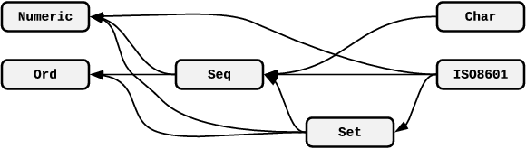

# Example - ISO8601

This example takes the ISO8601 example that is distributed with Overture and splits it into a number of components that
can be published and depended on by other projects.

This folder contains a number of sub-folders each of which is a Gradle project. These projects have the following
relationship:

<center><a href="images/ISO8601-Dependencies.png"></a></center>

We will publish the projects from left to right into a local Maven repository.

## Numeric

Switch into the `numeric` folder and observe that the `build.gradle` file applies the maven-publish plugin and declares
the location of a file based Maven repository.

Publish this project to the repository:

```
cd numeric
gradle publish
```

We can now check the Maven repository to determine what was published:

```
cd ..
ls .m2/repository/testing/numeric/1.0.0/
```

We can see that the artifacts that were built in our VDM project have been published to the Maven repository.

## Ord

Repeat the steps above for the `ord` folder, as this project also has no dependencies.

## Seq

Switch into the `seq` folder and examine the `build.gradle` file.

The specification in this project depends upon the modules in both of the `numeric` and `ord` projects, so dependencies
have been added to the file:

```
dependencies {
  vdm group: 'testing', name: 'numeric', version: '1.0.0'
  vdm group: 'testing', name: 'ord', version: '1.0.0'
}
```

Gradle will fetch these dependencies us from the declared repositories (the `build.gradle` file has declared our local
repository as one such).

```
cd seq
gradle dependencyUnpack --info
```

At the bottom of the log we will see the result of the dependencyUnpack task:

```
> Task :dependencyUnpack
Putting task artifact state for task ':dependencyUnpack' into context took 0.0 secs.
Executing task ':dependencyUnpack' (up-to-date check took 0.0 secs) due to:
  Task has not declared any outputs.
Unpack artifact: testing:numeric:1.0.0
Unpack artifact: testing:ord:1.0.0

:dependencyUnpack (Thread[Task worker for ':',5,main]) completed. Took 0.026 secs.

BUILD SUCCESSFUL in 0s
1 actionable task: 1 executed
```

We can see that the two artifacts have been unpacked and if we browse the `build/vdm/dependencies` folder we will find
the extracted files.

Now we can publish the `seq` project.

```
gradle publish
cd ..
```

## Set

Switch into the `set` folder and examine the `build.gradle` file.

Although the set project depends upon the modules from all of the `numeric`, `ord` and `seq` projects, we have only
declared the dependency on `seq` as the other projects will be acquired transitively.

We can view a tree of dependencies:

```
cd set
gradle dependencies
```

This gives us:

```
vdm
\--- testing:seq:1.0.0
     +--- testing:numeric:1.0.0
     \--- testing:ord:1.0.0
```

Now we can publish the `set` project.

## Char/ISO8601

These projects can now be built and published in the same way as all their dependencies have been published to our Maven
repository.

## Component re-use

We can now declare additional projects that might have a dependency on the modules in `set` without having to also
import ISO8601. Small, shareable components encourage re-use and allow specifiers to focus on the important aspects of
their system rather than the common 'toolkits'.

## A note on repositories

This example use a file-based repository so that the examples can be easily encapsulated. In practice, an artifact
repository such as [Nexus](https://www.sonatype.com/nexus-repository-sonatype)
or [Artifactory](https://jfrog.com/artifactory/) will be used so that arifacts can be shared between employees in a
company.

On a wider scale, artifacts could also be published to a centralized artifact repository (c.f. Maven Central) so that
they can be shared universally.
